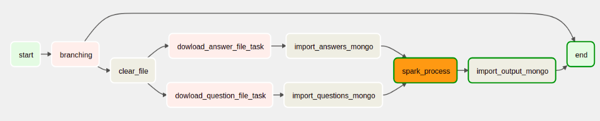

## Thiết lập DataPipeline cho dữ liệu lớn từ Cloud
### 1.Tổng quan
- Trong project này, ta sẽ thực hành để tạo một Data Pipeline hoàn chỉnh để có thể làm các thao tác như tải tập dữ liệu, import tập dữ liệu vào Database và xử lý dữ liệu với Spark. Sản phẩm sẽ là một Data Pipeline có các bước như sau:

### 2. Yêu cầu
- Cài airflow, spark, mongo trên máy ảo ubuntu
### 3. Tài nguyên
- [Answers.csv](https://drive.google.com/file/d/1gEU9KojKI3yMybjL0_tYsQnzRlUoBYro/view?usp=sharing)
File csv chứa các thông tin liên quan đến câu hỏi của hệ thống, với cấu trúc như sau:

  - Id: Id của câu trả lời.
  
  - OwnerUserId: Id của người tạo câu trả lời đó. (Nếu giá trị là NA thì tức là không có giá trị này).
  
  - CreationDate: Ngày câu hỏi được tạo.
  
  - ClosedDate: Ngày câu hỏi kết thúc (Nếu giá trị là NA thì tức là không có giá trị này).
  
  - Score: Điểm số mà người tạo nhận được từ câu hỏi này.
  
  - Title: Tiêu đề của câu hỏi.
  
  - Body: Nội dung câu hỏi.
- [Questions.csv](https://drive.google.com/file/d/1yH2lTY3mGOoGEDW1Y2lhzRwDuaZvI1KI/view?usp=sharing)
File csv chứa các thông tin liên quan đến câu trả lời và có cấu trúc như sau:

  - Id: Id của câu hỏi.
  
  - OwnerUserId: Id của người tạo câu hỏi đó. (Nếu giá trị là NA thì tức là không có giá trị này)
  
  - CreationDate: Ngày câu trả lờiđược tạo.
  
  - ParentId: ID của câu hỏi mà có câu trả lời này.
  
  - Score: Điểm số mà người trả lờinhận được từ câu trả lời này.
  
  - Body: Nội dung câu trả lời.

